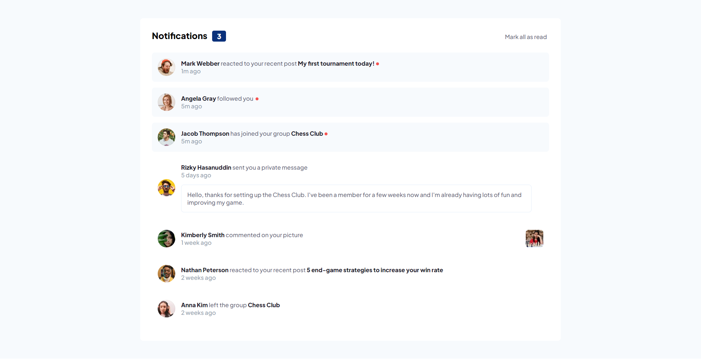
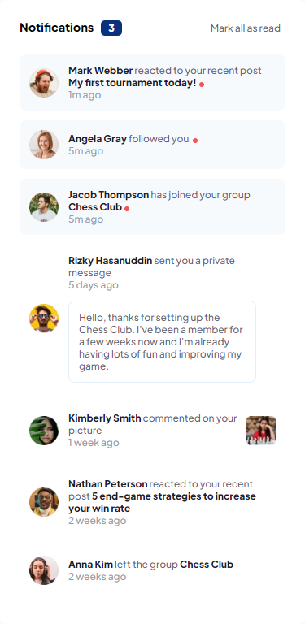

# Frontend Mentor - Notifications page solution

This is a solution to the [Notifications page challenge on Frontend Mentor](https://www.frontendmentor.io/challenges/notifications-page-DqK5QAmKbC). Frontend Mentor challenges help you improve your coding skills by building realistic projects.

## Table of contents

- [Overview](#overview)
  - [The challenge](#the-challenge)
  - [Screenshot](#screenshot)
  - [Links](#links)
- [My process](#my-process)
  - [Built with](#built-with)
  - [What I learned](#what-i-learned)
  - [Continued development](#continued-development)
- [How to start using this repo](#how-to-start-using-this-repo)

## Overview

### The challenge

Users should be able to:

- Distinguish between "unread" and "read" notifications
- Select "Mark all as read" to toggle the visual state of the unread notifications and set the number of unread messages to zero
- View the optimal layout for the interface depending on their device's screen size
- See hover and focus states for all interactive elements on the page

### Screenshot

#### Desktop



#### Mobile



### Links

- Solution URL: [link](https://your-solution-url.com)
- Live Site URL: [link](https://your-live-site-url.com)

## My process

### Built with

- Semantic HTML5 markup
- CSS custom properties
- Flexbox
- Vue3 + Typescript
- Vite
- Vitest for unit test
- Storybook to speed-up UI components development

### What I learned

I learned how to import and use variable fonts in CSS

```css
@font-face {
  font-family: "Plus Jakarta Sans";
  src: url("/fonts/PlusJakartaSans-VariableFont_wght.ttf") format("truetype-variations");
  font-weight: 500 800;
}
```

### Continued development

The possible next steps for the project:

- mark single notification as read
- full-stack solution

## How to start using this repo

This template should help get you started developing with Vue 3 in Vite.

## Recommended IDE Setup

[VSCode](https://code.visualstudio.com/) + [Volar](https://marketplace.visualstudio.com/items?itemName=Vue.volar) (and disable Vetur) + [TypeScript Vue Plugin (Volar)](https://marketplace.visualstudio.com/items?itemName=Vue.vscode-typescript-vue-plugin).

## Type Support for `.vue` Imports in TS

TypeScript cannot handle type information for `.vue` imports by default, so we replace the `tsc` CLI with `vue-tsc` for type checking. In editors, we need [TypeScript Vue Plugin (Volar)](https://marketplace.visualstudio.com/items?itemName=Vue.vscode-typescript-vue-plugin) to make the TypeScript language service aware of `.vue` types.

If the standalone TypeScript plugin doesn't feel fast enough to you, Volar has also implemented a [Take Over Mode](https://github.com/johnsoncodehk/volar/discussions/471#discussioncomment-1361669) that is more performant. You can enable it by the following steps:

1. Disable the built-in TypeScript Extension
   1. Run `Extensions: Show Built-in Extensions` from VSCode's command palette
   2. Find `TypeScript and JavaScript Language Features`, right click and select `Disable (Workspace)`
2. Reload the VSCode window by running `Developer: Reload Window` from the command palette.

## Customize configuration

See [Vite Configuration Reference](https://vitejs.dev/config/).

## Project Setup

```sh
npm install
```

### Compile and Hot-Reload for Development

```sh
npm run dev
```

### Type-Check, Compile and Minify for Production

```sh
npm run build
```

### Run Unit Tests with [Vitest](https://vitest.dev/)

```sh
npm run test:unit
```

### Lint with [ESLint](https://eslint.org/)

```sh
npm run lint
```

### Start [Storybook](https://storybook.js.org/)

```sh
npm run storybook
```
